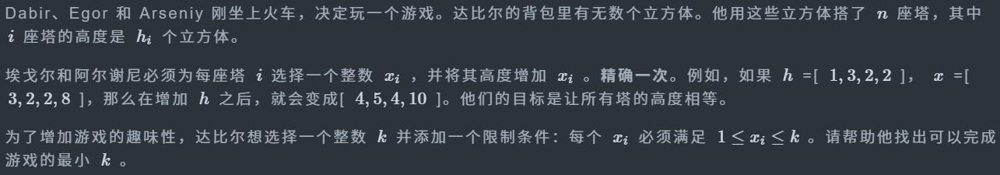

# CF2236A Games on the Train

## 题目描述

Dabir, Egor, and Arseniy just got on the train and decided to play a game. Dabir has a backpack with an infinite number of cubes. He built  $ n $  towers from them, where the  $ i $ -th tower has height  $ h_i $  cubes.

Egor and Arseniy must choose an integer  $ x_i $  for each tower  $ i $  and increase its height by  $ x_i $  exactly once. For example, if  $ h $  = \[ $ 1, 3, 2, 2 $ \],  $ x $  = \[ $ 3, 2, 2, 8 $ \], then after increasing  $ h $  it will become \[ $ 4, 5, 4, 10 $ \]. Their goal is to make the heights of all towers equal.

To make the game more interesting, Dabir wants to choose an integer  $ k $  and add a restriction: each  $ x_i $  must satisfy  $ 1 \le x_i \le k $ . Help him find the smallest  $ k $  for which it is possible to finish the game.



## 输入格式

The first line contains a single integer  $ t $  ( $ 1 \le t \le 10^4 $ ) — the number of test cases.

Then  $ t $  test cases follow.

The first line of each test case contains a single integer  $ n $  ( $ 1 \le n \le 5 $ ).

The second line contains  $ n $  integers  $ h_1, h_2, \dots, h_n $  ( $ 1 \le h_i \le 6 $ ).


## 输出格式

For each test case, output a single integer — the minimum value of  $ k $  such that it is possible to make all towers have equal height.


## 输入输出样例 #1

### 输入 #1

```
4
2
1 3
3
2 6 4
5
5 4 6 6 1
4
3 3 3 3
```

### 输出 #1

```
3
5
6
1
```

## 题解

```c++
#include <bits/stdc++.h>
using namespace std;
const int INF = 0x3f3f3f3f;

int main() {
    std::ios::sync_with_stdio(false);
    cin.tie(nullptr);
    cout.tie(nullptr);
    int _;
    cin >> _;
    while (_--) {
        int sz;
        cin >> sz;
        vector<int> arr(sz);
        int _max = -INF;
        int _min = INF;
        for (int i = 0; i < sz; ++i) {
            cin >> arr[i];
            _max = max(_max, arr[i]);
            _min = min(_min, arr[i]);
        }
        cout << _max - _min + 1 << "\n";
    }
    return 0;
}
```

