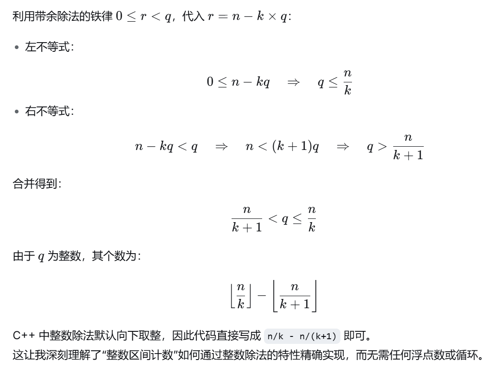

# P11184 带余除法

## 题目背景

**注意：提交至洛谷时，请使用标准输入输出，而非文件输入输出。**

**NOTICE: When submitting your code on Luogu site, please use standard IO instead of file IO.**

[点我（或在本题底部）下载中文试题 PDF。](https://www.luogu.com.cn/fe/api/problem/downloadAttachment/asjh3my3?contestId=200686)

[Click here (or at the bottom  of this page) to download the English version of statements (PDF).](https://www.luogu.com.cn/fe/api/problem/downloadAttachment/lkux3617?contestId=200686)

**注意：本次比赛所有题目的大样例均为 Linux 换行符格式，在 Windows 系统内可能无法正常显示换行。**

## 题目描述

我们已经学过带余除法。对于两个正整数 $n,q$，如果 $n$ 除以 $q$ 的商为 $k$，余数为 $r$，我们可以写出带余除法算式 $n\div q = k \cdots\cdots r$，或被记为 $n\div q = k (\text{r. } r)$。本题中，为了简化，哪怕 $r=0$，我们也要写出这个余数。

现在有一个带余除法，然而你只知道被除数 $n$ 和商 $k$，而并不知道除数 $q$ 和余数 $r$。你想知道余数有多少种可能。

## 输入格式

**本题有多组测试数据**。输入的第一行有一个正整数 $T$，表示数据组数。

之后 $T$ 行，每行有一个正整数 $n$ 和自然数 $k$，分别表示带余除法的被除数和商。

## 输出格式

对于每组测试数据，输出一行一个自然数，表示余数的不同可能性数量。

## 输入输出样例 #1

### 输入 #1

```
2
10 2
1 0

```

### 输出 #1

```
2
1

```

## 输入输出样例 #2

### 输入 #2

```
参见 division/division2.in
```

### 输出 #2

```
参见 division/division2.ans
```

## 说明/提示

【样例 1 解释】

对于第一组数据，被除数为 $10$，商为 $2$。

- 如果除数是 $1,2,3$，那么商分别是 $k=10,5,3$，不符合题意。
- 如果除数是 $4$，那么商为 $2$，余数为 $r=2$。
- 如果除数是 $5$，那么商为 $2$，余数为 $r=0$。
- 如果除数是 $6,7,8,9,10$，那么商都是 $1$，不符合题意。
- 如果除数 $>10$，那么商为 $0$，不符合题意。

对于第二组数据，被除数为 $1$，商为 $0$。

只要除数 $q>1$，那么 $1\div q = 0 \cdots\cdots 1$ 一定是正确的带余除法算式。余数只有 $1$ 这一种可能。

【数据范围】

对于前 $30\%$ 的数据，保证 $1\le n\le 1000$，$0\le k\le 1000$。

另有 $20\%$ 的数据，保证 $k\le 10^5$。

另有 $20\%$ 的数据，保证 $k\ge 10^9$。

对于全体数据，保证 $1\le T\le 10$，$1\le n\le 10^{14}$，$0\le k\le 10^{14}$。

```c++
#include <bits/stdc++.h>
using namespace std;
typedef long long LL;
LL T, n, k;
int main() {
    for (cin >> T; T > 0; --T) {
        cin >> n >> k;
        if (k != 0)  {
            cout << n/k - n/(k+1) << endl;
        }
        else {
            cout << 1 << endl;
        }
    }
    return 0;
}
```

## 题目核心
已知被除数 n 和商 k，求可能的余数 r 的个数。除数用 q 表示，必须满足 0 <= r < q。

---

## 收获 1：建立“余数”和“除数”的一一对应关系（转化思维）

由带余除法公式：
n = k * q + r
移项得：
r = n - k * q

当 n 和 k 固定时，r 随 q 的增大而严格减小（斜率是 -k）。
所以：
不同的 q 一定对应不同的 r，反过来也成立。

因此，这道题的核心窍门是：
“数出合法除数 q 的个数” 完全等价于 “数出合法余数 r 的个数”。

---

## 收获 2：严格推导出除数的整数范围（数学落地）




---

## 收获 3：边界条件 k=0 的逻辑

当 k=0 时，商为 0。
这意味着除数 q 必须大于被除数 n（否则商至少是 1）。
此时不管 q 取多少，余数 r 都等于 n 本身（因为 n = 0*q + n）。

所以余数永远只有 1 种情况，输出 1。

如果不加这个特判：
- 数学上，公式 n/(k+1) 虽然还能算，但 n/k 会变成除以 0，程序直接崩溃。
- 所以特判既符合数学逻辑，也是程序的自我保护。

---

## 收获 4：用小数据验证公式

用 n=5, k=1 来手动验证：

q 的范围是：5/(1+1) < q <= 5/1，即 2.5 < q <= 5
合法的整数 q 有：3, 4, 5

分别代入算余数：
q=3 => r = 5 - 1*3 = 2 （验算：5÷3=1余2，成立）
q=4 => r = 5 - 1*4 = 1 （验算：5÷4=1余1，成立）
q=5 => r = 5 - 1*5 = 0 （验算：5÷5=1余0，成立）

正好得到 3 个不同的余数 {2,1,0}。
公式：5/1 - 5/2 = 5 - 2 = 3，完全匹配。

这验证了我们的推导完全正确。

---

## 收获 5：O(1) 算法 vs 暴力枚举

如果不推公式，可能会想到写 for 循环去枚举 q 或 r。
但 n 的数据范围可能达到 10^9 甚至 10^18，循环根本跑不完。

通过数学推导，我们只需要做两次除法运算。
这让我深刻理解到：
“最好的优化不是让循环跑得更快，而是直接消灭循环。”

---

## 最终 AC 代码（已经处理好 k=0 的情况）

```cpp
#include <bits/stdc++.h>
using namespace std;
typedef long long LL;

int main() {
    int T;
    cin >> T;
    while (T--) {
        LL n, k;
        cin >> n >> k;
        if (k == 0) {
            cout << 1 << '\n';
        } else {
            cout << n / k - n / (k + 1) << '\n';
        }
    }
    return 0;
}
